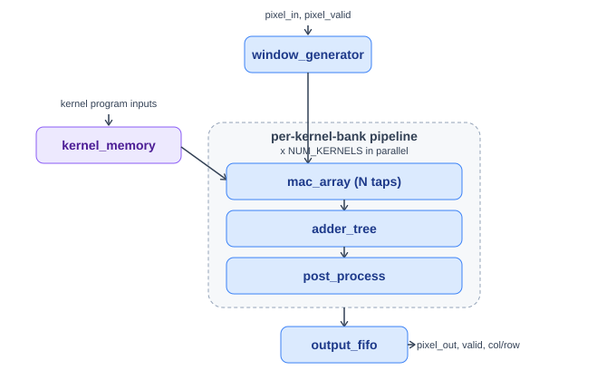
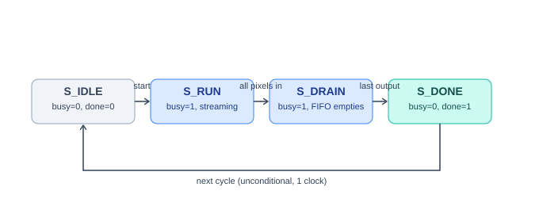

# NxN CNN Convolution Accelerator

A parameterizable, pipelined FPGA accelerator for 2D convolution, built in SystemVerilog for the **IEEE SSCS Egypt Chapter 2026 Student Design Competition** (Edge-AI vision accelerator).

Streams a grayscale image one pixel per cycle, convolves it against one or more independently-programmable $N \times N$ kernels in parallel, and emits saturating 16-bit signed results with optional ReLU, implemented, synthesized, and verified two independent ways.

## Highlights

- **Fully parameterized**: kernel size, image dimensions, and number of parallel kernel banks are all synthesis-time parameters, not hardcoded for one configuration.
- **Multi-channel-in-one-cycle**: multiple kernel banks evaluate the *same* sliding window in parallel and produce all results the same cycle, not sequential re-runs of the image.
- **One output per cycle** in steady state
- **Saturating arithmetic + optional ReLU**, with verified precedence between the two.
- **Verified four independent ways**: a self-checking SystemVerilog testbench, an independent Python/NumPy golden model, and two directed corner-case testbenches closing specific coverage gaps.
- **Synthesized and place-and-routed** on a real target (PYNQ-Z2 / Zynq-7020) with an investigated timing closure result.

## Architecture

<p align="center">
  
</p>

`window_generator` and `kernel_memory` feed a per-kernel-bank pipeline (`mac_array` → `adder_tree` → `post_process`), replicated once per kernel bank. Every bank shares the same sliding window and produces its result on the same cycle; results are packed into a single output FIFO widened to hold one entry per window position.

<p align="center">
  
</p>

| Module | Purpose |
| --- | --- |
| `window_generator.sv` | Builds the $N\times N$ sliding window from the incoming pixel stream. |
| `line_buffer.sv` | Per-row delay line used by `window_generator` ($N-1$ rows of history). |
| `kernel_memory.sv` | Stores coefficients for `NUM_KERNELS` independently-addressable banks. |
| `mac_array.sv` | $N^2$ parallel signed multiplies, one bank's worth. |
| `adder_tree.sv` | Generic pipelined reduction tree, any input count, not hand-unrolled for one kernel size. |
| `post_process.sv` | Optional ReLU, then saturate to 16-bit signed. |
| `output_fifo.sv` | Output-side rate-decoupling FIFO; packs every bank's result per window position into one entry. |
| `cnn_accelerator.sv` | Top level: control FSM, `NUM_KERNELS` banks in parallel, FIFO packing. |

## Configuration

| Parameter | Default | Description |
| --- | --- | --- |
| `IMAGE_WIDTH` / `IMAGE_HEIGHT` | 32 / 32 | Input dimensions (minimum 32×32 per spec). |
| `KERNEL_SIZE` | 3 | Kernel dimension $N$. |
| `NUM_KERNELS` | 1 | Number of parallel kernel banks. |

| Property | Value |
| --- | --- |
| Input precision | 8-bit unsigned |
| Kernel precision | 8-bit signed |
| Accumulator | 32-bit signed |
| Output precision | 16-bit signed, saturating |
| Stride | 1 |
| Activation | Optional ReLU (`relu_enable`) |
| Output order | Row-major over window positions |

## Interface

Top-level module: `cnn_accelerator` (`rtl/cnn_accelerator.sv`).

- Program kernel coefficients via `kernel_we` / `kernel_sel` / `kernel_addr` / `kernel_data` while idle (`kernel_sel` selects which of the `NUM_KERNELS` banks a write targets).
- Assert `start` to begin streaming; present pixels via `pixel_valid` / `pixel_in` in raster order.
- Sample `pixel_out[k]` / `output_row` / `output_col` whenever `output_valid` is asserted, one entry per window position, all `NUM_KERNELS` banks valid simultaneously.
- `busy` is high while processing; `done` pulses for one cycle at the end, after which the accelerator is immediately ready for another `start` with no reset required.

## Repository Layout

```text
rtl/            Synthesizable SystemVerilog sources
tb/             Testbenches (see Verification below)
python/         golden_model.py, independent Python/NumPy reference model
run_*.do        Questa/ModelSim simulation scripts, one per testbench
run_synthesis.tcl           Vivado batch synthesis + implementation script
cnn_accelerator_synth.xdc   Timing constraints
requirements.txt            Python dependencies (for golden_model.py)
```

## Verification

| Testbench | Approach | Result |
| --- | --- | --- |
| `cnn_accelerator_tb.sv` | Self-checking; full 32×32 image, two directed kernels, checks every output's value/row/col plus cycle-to-cycle throughput | **PASS**, 0 errors |
| `cnn_accelerator_golden_tb.sv` + `python/golden_model.py` | Independent Python/NumPy reference model with zero shared code with the RTL; randomized stimulus, cross-checked twice (in-sim and standalone) | **PASS**, 0 errors |
| `cnn_accelerator_saturation_tb.sv` | Directed test hitting the exact $\pm32767/\pm32768/\pm32769$ saturation boundaries | **PASS**, 0 errors |
| `cnn_accelerator_relu_tb.sv` | ReLU on/off comparison, including its precedence over negative saturation | **PASS**, 0 errors |

Two real bugs were found and fixed during this process: a hardcoded FIFO prefill threshold that deadlocked on small test images, and a testbench checker race condition that produced spurious off-by-one failures. Both are documented in the full design report.

### Running the testbenches (QuestaSim / ModelSim)

Each `run_*.do` script is self-contained: it rebuilds the `work` library from scratch, compiles, elaborates with full waveform visibility, and runs.

```tcl
do run_self_check_tb.do
do run_saturation_tb.do
do run_relu_tb.do
```

The golden-model testbench additionally needs generated vectors first (an isolated `uv` virtual environment is recommended so `numpy` doesn't need installing system-wide):

```bash
uv venv
uv pip install -r requirements.txt
```
```tcl
do run_golden_tb.do
```
followed by an independent, out-of-simulator cross-check:
```bash
python python/golden_model.py compare --outdir vectors --actual vectors/actual_output.hex --num-kernels 1
```

## FPGA Results

Synthesized and place-and-routed for the **PYNQ-Z2** board (Zynq-7020, `xc7z020clg400-1`) in Vivado, default configuration (32×32, 3×3, single kernel bank), 100 MHz target:

| Metric | Result |
| --- | --- |
| LUTs | 1558 (2.9% of device) |
| Flip-flops | 2766 (2.6% of device) |
| DSP48E1 / BRAM | 0 / 0 |
| Timing | **Met** , WNS +1.868 ns, WHS +0.048 ns (post-route) |
| Power (post-route estimate) | 0.144 W |
| FOM | $\approx 4.46 \times 10^{-3}$ |

```bash
vivado -mode batch -source run_synthesis.tcl
```

Reports (timing, utilization, DSP usage, power) are written to `synth_out/`.

## Documentation

A full design report, architecture rationale, per-module deep dives, fixed-point analysis, complete verification methodology, and the FOM design-tradeoff analysis, is included in this repository.

## License

MIT License.
